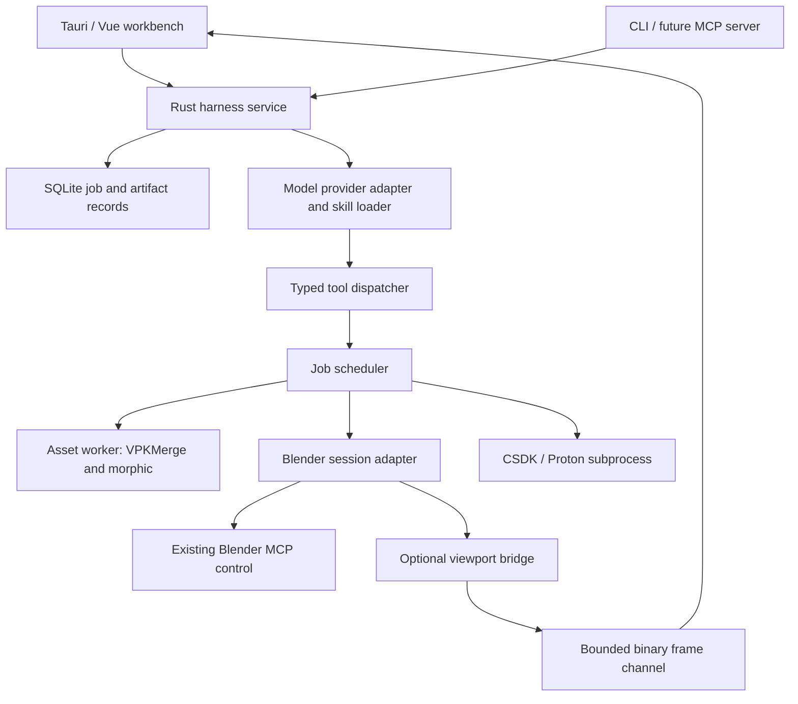

# Modding harness: architecture and delivery contract

Status: proposed design, 2026-09-29. Implemented: Rust project manifest, read-only
CLI tools, two repository-owned skills, and the first desktop Workshop slice with
local Blender addon scene inspection and still snapshots. The broader lifecycle,
live-view, and agent integrations below remain proposed.

## Product boundary

A local workbench for creating Deadlock mods with VPKMerge, Blender, and optional
CSDK compilation. A user can inspect assets, request edits, review the result,
build a VPK, and resume the project later with its sources and evidence intact.

Recommended first UI: existing Tauri 2 + Vue 3 application, with TypeScript for
new harness components. Keep all execution/state contracts in Rust. Adopt Tokio
for process/I/O orchestration, SQLite for transactional job metadata, and ordinary
files for large assets. These are proposed additions, not current dependencies.

Linux is the first validation target. Record distribution, desktop session,
display protocol, GPU/driver, Blender version, and webview version for preview
tests. Windows/macOS support requires separate validation, especially CSDK launch.

The initial side pane recommendation is a live Blender view with navigation and
selection. Full manual Blender UI inside the pane remains a product decision and
an independent feasibility spike. Do not silently equate those two experiences.

## Application layout

```text
Projects / assets | Conversation, plan, tool results | Blender view
                  |                                | Selection / properties
                  |                                | Preview / artifacts
------------------+--------------------------------+----------------------
Runs, progress, compiler logs, validation, output VPKs
```

Pane resize/pop-out, clear connection status, frame age, cancel controls, and an
Open in Blender action belong in the first UI. A stale image must look stale.
Image/render previews and a live viewport need distinct labels.

## Ownership and process boundaries



- The Rust service owns job state, artifact registration, capabilities, and tool
  authorization. The UI and model request work through the same dispatcher.
- Start with the service hosted by Tauri and callable as a library by the CLI.
  Closing the app interrupts running work; a persistent daemon is a later choice.
- Long asset tasks use child worker processes so the supervisor can remain
  responsive and cancel them. The worker calls the Rust core directly.
- Blender owns the live scene. The database records checkpoints and references,
  not an independent editable copy of the scene.
- Each Blender session has one mutation queue. A compiler addon staging tree has
  one owner. Independent jobs can run concurrently within configured limits.
- GPT reasons about the request and chooses tools. It does not own job truth or
  decide whether a compiler result is valid.

## Blender pane: feasibility and design

### Recommended route

Keep Blender as a separate process. Attach to a user-selected session or launch
a project-specific session; never take over the first available scene silently.
Use MCP for scene inspection, scripted edits, checkpoints, export, and renders.
Use a separate optional bridge for continuous frames and navigation.

The installed Blender 5.2 addon was inspected read-only during planning. Its
`get_viewport_screenshot` calls `bpy.ops.screen.screenshot_area`, loads the saved
image, optionally resizes it, and returns a file path. Its command handler queues
work through `bpy.app.timers.register`. This supports snapshot prototyping; it
does not establish a low-latency video stream or interactive embedded editor.

Prototype offscreen viewport capture using Blender's GPU API in a valid graphics
context. Keep all Blender API work in supported main-thread/draw callbacks.
Perform encoding and transport outside Blender where practical. Do not infer
thread safety from the existing addon's use of socket threads. Verify capture
while the window is occluded/minimized and after file/context changes; a running
Blender process alone does not guarantee a usable GPU context.

Transport starts with bounded compressed image frames through a local binary
channel. The service holds at most the latest frame and one frame in flight.
Frames carry session ID, generation, scene revision, view ID, sequence number,
dimensions, and capture time. Drop obsolete frames, stop capture when hidden,
and cap resolution/rate. Avoid sending continuous frames through MCP, JSON
base64 event payloads, or the model conversation. The model requests a selected
snapshot when it needs visual evidence.

Navigation is direct UI-to-adapter input, without a model round trip. Start with
orbit, pan, zoom, frame selection, and object-list selection. Add click picking
only with normalized coordinates plus the matching view/frame revision. Reject
stale picking requests. Use stable session-scoped object IDs, not names alone.
Manual transforms and gizmos are a later feature with their own undo semantics.

### Alternatives and decision gates

| Option | Role | Decision |
| --- | --- | --- |
| MCP snapshots | Quick preview proof and fallback | Implement first |
| Streamed Blender viewport | Live appearance with limited controls | Recommended, benchmark before commitment |
| Browser GLB viewer | Fast independent orbit/inspection | Optional; cannot establish Blender appearance or unsaved state |
| Full Blender UI streamed with input forwarding | Manual modeling within a pane | Separate remote-display prototype if required |
| Native window reparenting | Embed an external editor window | Do not make it the baseline without platform-specific proof |

Changing Tauri to Electron does not establish full Blender embedding. If full
editor interaction is required, benchmark a local remote-display session with
keyboard focus, text input, shortcuts, file dialogs, resizing, GPU acceleration,
and reconnect. Revisit the webview choice only if that experiment exposes a
specific limitation. No claim of cross-platform editor embedding is made here.

Target for the live-view spike, not a measured promise: 1280x720 at 15 fps with
p95 navigation-to-visible-frame latency below 200 ms on the primary workstation
and a representative textured hero scene. Record CPU/GPU load, memory, scene
size, frame age, and dropped frames. Test a 30-minute session plus 20 reconnects.
If the target fails, ship explicit snapshot mode and keep the live feature gated.

## Project and artifact model

Separate portable project intent from workstation configuration. The existing
v1 manifest mixes these; introduce an explicit migration before changing it.
Never silently reinterpret existing fields.

| Record | Required content |
| --- | --- |
| Project/recipe | Schema version, project ID, requested outcome, source references, ordered operations, explicit collision policy, selected skill versions |
| Machine profile | Game install, CSDK/Proton/Blender executables, MCP launch config, staging roots; credentials stored separately |
| Blender session | Session/generation IDs, connected version, project association, last checkpoint, scene revision, mutation status |
| Run | ID, recipe revision, input fingerprints, tool versions, steps, timestamps, cancellation/error status |
| Artifact | ID, role, path, content hash, producing step, dependencies, verification records |
| Verification | Check type, tool/game build, evidence, result; manual retail test records separate from offline checks |

Keep sources, checkpoints, exports, logs, and final artifacts in separate project
directories. Staging belongs to a run. Publish outputs only after validation and
atomic finalization on the destination filesystem. Do not overwrite a source VPK.
Store SQLite transactions for metadata, not Blender scenes or VPK bytes.

Use archive fingerprints for source freshness and entry hashes for output
equivalence; existing packing may not produce stable whole-archive bytes. Avoid
hashing an entire game installation on each request. Snapshot relevant entry
inventories and invalidate cached observations when the source changes.

## Execution, recovery, and human editing

Job states: queued, running, cancelling, cancelled, succeeded, failed,
interrupted. Each step records start, outcome, output IDs, and structured error
code. UI progress reflects actual stage/progress evidence, not guessed percentages.

Persist intent before a mutation and commit its result afterward. A crash between
those points leaves an interrupted operation for reconciliation. Do not claim
exactly-once external side effects. Read-only calls may retry with bounds; Blender
edits and compiler invocations require reconciliation before any retry.

Cancellation terminates owned compiler/worker process groups and marks incomplete
outputs unusable. Cancellation of an attached Blender operation is cooperative;
do not kill a user's Blender process. Display cancelling until termination is
confirmed, or interrupted/unknown if contact is lost.

Checkpoint before a substantial agent edit. Detect scene changes and check the
expected revision before the next mutation. Human editing invalidates an agent's
stale assumptions and pauses dependent steps. Blender undo is a convenience;
saved checkpoints are the durable recovery mechanism. Reconnecting creates a
new session generation and invalidates stale object handles and frames.

CSDK uses unique per-run addon names, captures exit status and logs, checks that
expected outputs are newly produced, and resolves dependencies before packing.
A file left by a previous compile cannot satisfy the current run. Record CSDK
and retail build context; compiler success is only one verification record.

## Tool and agent contracts

Extend the current `ToolCall` seam with versioned JSON schemas and generated UI
types. Each tool declares input/output types, effect class, prerequisites,
timeout, retry policy, and whether it returns immediately or creates a job.
Use structured errors such as missing_dependency, stale_scene, unsupported_format,
compile_failed, and connection_lost with actionable context.

Three invocation surfaces share the dispatcher: local CLI, Tauri, and a future
MCP server. The harness also acts as an MCP client for Blender. Its current
`mcp_server_name` alone cannot connect a standalone app: machine configuration
must supply a supported launch/attach transport and capabilities handshake.

Retain arbitrary Blender scripting for exploratory work when requested, with
visible code/results and checkpoints. Promote repeated successful scripts into
typed operations. Do not pretend unrestricted Python is a sandbox.

The model provider is behind an adapter. Tool results enter the conversation as
bounded summaries and artifact references. Load skills on demand, record their
revision, and cap model turns, tool calls, elapsed time, and spend. No continuous
viewport upload. A provider outage must not prevent inspection of local projects
or cancellation of jobs. Model integration is not implemented by this design doc.

## Local trust boundary

The frontend has no direct shell, compiler, or arbitrary filesystem capability.
The service checks project/artifact paths, approved external input roots, and
tool effect scope. User-selected MCP servers and skills are trusted executable
extensions; do not auto-execute instructions found in imported mod assets.
Any local frame/control endpoint needs session authentication and peer/origin
validation as applicable. Do not expose the raw Blender addon socket to the web.

Build and preview operate within the requested project scope. Installation and
publishing are separate tools governed by the user's authorization. No repeated
approval prompts for already-authorized steps. Keep credentials out of manifests
and logs, and verify third-party telemetry configuration before managed launch.

## Milestones and exit criteria

| Milestone | Deliverable | Acceptance |
| --- | --- | --- |
| M0: existing scaffold | Project init, doctor, inventory/conflicts, two skills | Current tests pass; features labeled honestly |
| M1: Blender feasibility | Attach/identify session, snapshot pane, offscreen/stream experiment | Correct scene; frame age; resize/disconnect/reconnect tested; measured live-view decision |
| M2: durable jobs | Project migration, database, staged merge worker, artifact records | Conflict winners verified by entry bytes; cancel/crash cannot register partial success; restart preserves history |
| M3: controlled Blender workflow | Inspect, checkpoint, edit, render/export | Human-edit conflict detected; stale handles rejected; restore checkpoint demonstrated |
| M4: CSDK build | Existing wrappers supervised through adapter | Fresh output/dependencies checked; timeout, failure, stale-file tests; one representative mod tested in retail |
| M5: GPT and workbench | Tool loop, skill loader, project/run/preview UI | Real-job evaluations pass; bounded recovery; errors remain inspectable without provider |

Evaluate at least: conflict-heavy merge, sound randomizer replacement, texture
edit, Blender hero preview/edit, HUD compile, and CSDK model compile. Include
missing assets, source updates, compiler failure, Blender busy/disconnected,
interrupted job, stale output, and a user edit during agent work. Check actual
artifact semantics and recorded evidence rather than exact model wording.

## Remaining decisions

1. Side pane: navigation/selection versus full manual Blender editor interaction.
2. Supported primary Linux/Blender/GPU combination, then expansion targets.
3. Attach to existing Blender by default or offer a dedicated project instance.
4. First engine-tested authoring recipe and source fixture.

Recommended next action: M1 feasibility spike before expanding the agent loop or
building a polished workbench. It determines the highest-risk product promise.

## References

- [Current scaffold](../vpkmerge-harness/README.md).
- [Previous MCP proposal](mcp-server-design.md).
- [Recorded Blender workflow](blender-mcp/workflows/load-hero-into-blender.md).
- [Blender GPU API](https://docs.blender.org/api/5.2/gpu.html): offscreen API reference; runtime behavior needs local testing.
- [Blender threading limitations](https://docs.blender.org/api/main/info_gotchas_threading.html).
- [Blender timers](https://docs.blender.org/api/4.2/bpy.app.timers.html): queued main-thread execution pattern; check installed-version behavior.
- [Tauri architecture](https://v2.tauri.app/concept/architecture/).
